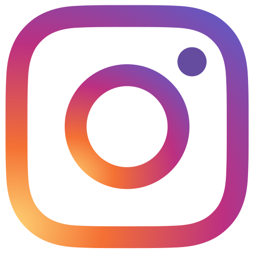

# 📸 Awesome Photography 

> This list aims to curate content that is interesting for photographers from around the world, if you feel the need please contribute

##### Obs: Markdown format doesn't accept in a new tab so if you want to stay in the list use the right click open in new tab or hold the CMD button and click on the link.

## Contents

List of content topics

- [Brands](#brands)

- [Podcasts](#podcasts)

- [Youtube](#youtube)

- [Utilities](#utilities)

- [Recommendations](#recommendations)

- [Posing Guide](#posing-guide)

- [Stores](#stores)

- [Courses](#courses)

- [Guides](#guides)

- [Contribute](#contribute)

## Brands

Brands and equipment most commonly used by professionals

- [Canon](https://global.canon/en)
- [Fuji](https://www.fujifilm.com/products/digital_cameras)
- [Nikon](https://www.nikon.com)
- [Sony](https://www.sony.com/electronics/cameras)

## Podcasts

List of podcast to know more about photography

- 🇧🇷&nbsp;[&nbsp;1 Podcast 2 Fotógrafas](https://open.spotify.com/show/55okLMQPkxr7h5701XOKJx?si=l3itd9SqQguokQi32tVugQ&nd=1) - 1 Podcast 2 Fotógrafas foi criado por Danielle Alves @quazar\_ e Marina Chalom @chalomphotography para falar um pouco de tudo que é tema e também de fotografia!. 
- 🇧🇷&nbsp;[&nbsp;Arquivo RAW](https://open.spotify.com/show/42E257grORV7pQ38ekjXv1?si=82gU6UVESyaQ8gnBSyukzg) - Aqui o assunto é fotografia. 
  
- 🇺🇸&nbsp;[&nbsp;B&H Photography Podcast](https://www.bhphotovideo.com/explora/podcasts) - Listen and learn with hands-on product demos, tips, buying guides and reviews. 
  
  
- 🇺🇸&nbsp;[&nbsp;Candela: Photography & Cinematography Masters](https://candela.podbean.com/) - The masters of photography and cinematography, in conversation with Alan Schaller and Christopher Hooton. 
  
  
- 🇧🇷&nbsp;[&nbsp;Câmara Escura](https://www.spreaker.com/show/camara-escura) - Esse é meu podcast pessoal onde misturo tudo o que gosto. Vamos falar de fotografia. 
  
  
- 🇺🇸&nbsp;[&nbsp;Classic Camera Revival](https://classiccamerarevival.podbean.com) - Looking at Cameras, Lens, Films, Development, tips, tricks, and techniques for all things related to Film Photography!. 
  
  
- 🇧🇷&nbsp;[&nbsp;Coisa de Fotógrafa](https://coisadefotografa.com/coisa-de-fotografa-podcast/) - Se você quer viver de fotografia e ter clientes todos os meses. 
  
  
- 🇧🇷&nbsp;[&nbsp;Dodge and Burn Podcast](https://anchor.fm/dodgeandburn) - Podcast sobre arte, mercado digital e curiosidades sobre o nosso universo e suas personalidades. 
- 🇧🇷&nbsp;[&nbsp;Luz com Café](https://www.grupoluz.com.br/) - Um podcast de dicas e opiniões valiosas sobre o mercado das imagens artísticas. 
  
- 🇺🇸&nbsp;[&nbsp;Film Photography Podcast](https://filmphotographypodcast.podbean.com/) - Topics will touch on all film formats (from pocket-sized 110 to medium format), do-it-yourself techniques, digital technologies, motion picture film making and more. 
  
  
- 🇺🇸&nbsp;[&nbsp;FroKnowsPhoto](https://froknowsphoto.com/podcast/) - This is where you can find fun and informative content to help you be a better photographer and video shooter. 
  
  
- 🇺🇸&nbsp;[&nbsp;Hit The Streets](https://valeriejardinphotography.com/podcast) - A Photography Podcast for the Urban Photographer. 
  
  
- 🇺🇸&nbsp;[&nbsp;Off Camera](https://theartofphotography.tv/off-camera) - Off Camera is a weekly podcast hosted by Ted Forbes and Jaron Schneider. 
- 🇺🇸&nbsp;[&nbsp;Off Camera with Sam jones](https://offcamera.com/) - Sam Jones, who created the show out of his passion for the long form conversational interview, and as a way to share his conversations with a myriad of artists, actors, musicians, directors, skateboarders, photographers, and writers that pique his interes. 
  
  
- 🇧🇷&nbsp;[&nbsp;Fotologia](https://www.fotologia.net/podcast/) - Pra quem ama e quer viver de fotografia. 
  
  
  
- 🇧🇷&nbsp;[&nbsp;Fotografia Pensante](https://omicronfotografia.com.br/blog/tags/podcast-de-fotografia) - É, acima de tudo, mais um canal de democratização da Cultura fotográfica. 
  
  
- 🇧🇷&nbsp;[&nbsp;Live de Foto](https://anchor.fm/livedefoto) - O que acontece quando quatro amigos sentam para conversar e por acaso todos são fotógrafos?. 
  
  
- 🇧🇷&nbsp;[&nbsp;Papo de Fotógrafo](https://www.papodefotografo.com.br/podcasts/) - O programa é uma mistura de podcast com bate-papo, com muita informação e diversão. 
  
- 🇧🇷&nbsp;[&nbsp;Papo Família](https://www.papodefotografo.com.br/podcasts/papo-familia/) - Um projeto criado especialmente para fotógrafos da área de newborn e família. 
  
- 🇺🇸&nbsp;[&nbsp;PetaPixel Photography Podcast](https://petapixel.com/podcast) - About the wonderful world of photography. It's a fusion of news, opinions, humor, and real-world. 
  
  
  
- 🇺🇸&nbsp;[&nbsp;Photobomb Photography](http://www.photobombpodcast.com) - Picture a drive-time morning radio show where the hosts happen to be professional photographers. 
  
  
- 🇺🇸&nbsp;[&nbsp;Photobiz Xposed](https://photobizx.com/interviews/) - The ultimate portrait and wedding photography business podcast.
  
  
- 🇧🇷&nbsp;[&nbsp;MobCast](https://linklist.bio/mobgrafando) - Podcasts cheios de conteúdo para entusiastas, iniciantes e profissionais da fotografia. 
  
- 🇺🇸&nbsp;[&nbsp;Six Figure Photography](https://www.sixfigurephotography.com/) - Discover how to use creative marketing techniques. 
  
  
- 🇺🇸&nbsp;[&nbsp;Tips from the Top Floor](https://tipsfromthetopfloor.com) - The show about all things photography with Chris Marquardt. 
  
  
- 🇺🇸&nbsp;[&nbsp;The Astrophotography Podcast](https://soundcloud.com/user-875470605) - Looking to take the plunge into the awesome hobby of astrophotography? This is the place to get a good start.
  
- 🇺🇸&nbsp;[&nbsp;The Art of Photography](https://theartofphotography.tv) - If you are a photographer, this is the show for you. 
- 🇺🇸&nbsp;[&nbsp;The Beginner Photography Podcast](https://www.beginnerphotographypodcast.com) - You're Going To Take Better Photos. Today. 
  
  
- 🇺🇸&nbsp;[&nbsp;The Business of Photography](https://getsproutstudio.com/community/business-of-photography-podcast/) - Concrete business ideas for professional photographers. 
  
  
- 🇺🇸&nbsp;[&nbsp;The Digital Story Photography](https://thedigitalstory.com/podcasts/latest/) - Photo tips, reader submitted pictures, equipment reviews and more. 
  
  
  
- 🇺🇸&nbsp;[&nbsp;The Candid Frame](https://www.ibarionex.net/thecandidframe) - Brings in-depth, intimate and thoughtful conversations with photographers on living a photographic life. 
  
  
  
- 🇺🇸&nbsp;[&nbsp;The Family Photographer](https://thefamilyphotographer.net/) - How can we take better photos of our family life? Why are we taking all these photos in the first place?. 
- 🇺🇸&nbsp;[&nbsp;The Fashion Photography Podcast](http://photographypodcast.net) - The show where we talk all about fashion photography. 
  
  
- 🇺🇸&nbsp;[&nbsp;The Martin Bailey Photography](https://martinbaileyphotography.com/podcasts) - Provides education and inspiration by covering a mix of art, creativity and technical topics, interviews, gear reviews and travelogue style episodes. 
  
  
- 🇺🇸&nbsp;[&nbsp;The Snappening](https://www.thesnappening.net) - Wedding Photography Podcast. 
  
  
- 🇺🇸&nbsp;[&nbsp;The Portrait System Podcast](https://suebryceeducation.com/podcast) - Join in as Nikki Closser, a mentor in the Sue Bryce Education community, interviews photographers. 
  
  
- 🇺🇸&nbsp;[&nbsp;This Week In Photo](https://thisweekinphoto.com/category/twip-episodes) - Discuss camera technique, technology and news. 
  
  
  
- 🇧🇷&nbsp;[&nbsp;SMIA - Santa Mãe do ISO alto](https://santamaedoisoalto.com.br) - é um podcast sobre audiovisual para discussão de assuntos relacionados a produção de vídeo, fotografia e afins. 
  
  
- 🇧🇷&nbsp;[&nbsp;Sobre Fotografia](https://iradex.net/categorias/podcasts/sobre-fotografia/) - Um podcast sobre as imagens que produzimos e as imagens que nos produzem. 
  
- 🇧🇷&nbsp;[&nbsp;Veri e Roger](https://www.verieroger.com.br/podcast/) - Falaremos sobre nossas experiências dentro da fotografia, aquilo que aprendemos, estamos errando, colocando em prática e quebrando "tabus" dentro do Newborn, Acompanhamento e Gestante. 
  
  
- 🇺🇸&nbsp;[&nbsp;Wedding Photo Hangover](https://weddinghangover.com/) - The finest in phototainment! We're an irreverent look at photography. 
  
- 🇺🇸&nbsp;[&nbsp;Wedding Photographers Unite](http://www.weddingphotographersunite.com/) - For Wedding Photographers, By Wedding Photographers. 

<!--
Template Podcast Item
- 🇧🇷&nbsp;[&nbsp;Template Podcast](https://example) - Description. 
  
  
   -->

## Youtube

Informative videos on photography, filming, editing and related topics.

- 🇧🇷&nbsp;[35 milímetros](https://www.youtube.com/channel/UCBeMB1BquDgEnY2kf0eFoKw) - "35mm" é um canal dedicado a fotografia.
- 🇧🇷&nbsp;[Ale Rodrigues](https://www.youtube.com/user/Alesgar1) - Fotografia, Inspiração e histórias por Ale Rodrigues.
- 🇧🇷&nbsp;[Allan Elly](https://www.youtube.com/user/allan2905) - Canal sobre fotografia de casamento e ensaios.
- 🇧🇷&nbsp;[Andre Pilli](https://www.youtube.com/c/andrepilli/videos) - Director based in LA, HP Ambassador for creative hardware.
- 🇧🇷&nbsp;[Andrey Lanhi - Back to Basics](https://www.youtube.com/user/amlanhi) - Micro Nano Empresário, nerd por profissão, completamente apaixonado pela minha família, fotografia e tecnologia.
- 🇧🇷&nbsp;[Abdala Brothers](https://www.youtube.com/c/AbdalaBrothers1) - Film & FX division Basically, we're magicians behind cameras and computers.
- 🇧🇷&nbsp;[Armando Vernaglia Jr](https://www.youtube.com/channel/UCpFSFUvYFhb1I6_LxK8zLTw) - Armando Vernaglia Jr, fotógrafo, cinegrafista, professor, youtuber, músico, tomador de café, entre outras coisas.
- 🇧🇷&nbsp;[Arruma na Edição](https://www.youtube.com/channel/UCNe8-yisU-oqHz9MxcHF_2A) - Aqui falaremos tudo sobre o mundo Audiovisual.
- 🇧🇷&nbsp;[Arthur Rosa](https://www.youtube.com/c/ArthurRosaTV) - Dicas de fotografia, cursos de fotografia grátis, dicas de marketing para fotógrafos, Instagram para fotógrafos, etc.
- 🇧🇷&nbsp;[Audiovizuando](https://www.youtube.com/c/audiovizuando) - Descomplicando o audiovisual de A a Z!
- 🇧🇷&nbsp;[AvMakers](https://www.youtube.com/user/BaltarejoTutoriais) - Escola online para Filmmakers e Fotógrafos.
- 🇧🇷&nbsp;[Beatriz Cavalcanti](https://www.youtube.com/channel/UCVqIyDguAw-VkfMeJDK5bow) - Olá internet! Beatriz Cavalcanti aqui.
- 🇧🇷&nbsp;[Beto Gonsalvo](https://www.youtube.com/channel/UCfiWOadj81KsQAOfgp6Q88Q) - Esse é um canal voltado para os amantes de fotografia e cinema, com dicas e muita conversa boa, sobre as mais variadas formas de arte e suas vertentes.
- 🇧🇷&nbsp;[BIGSHINE PRO](https://www.youtube.com/channel/UCfiWOadj81KsQAOfgp6Q88Q) - A BIGSHINE PRO é uma produtora independente.
- 🇧🇷&nbsp;[BLK Midia](https://www.youtube.com/user/blkmidia) - Reviews, dicas e tutoriais de fotografia, áudio e vídeo.
- 🇧🇷&nbsp;[Breno Raffa](https://www.youtube.com/channel/UC99uM6B8vmvcHgW1wRTN6-Q) - Sou fotógrafo, editor, às vezes filmmaker, e aqui compartilho meu conhecimento sobre fotografia!
- 🇧🇷&nbsp;[Bruno Nonogaki](https://www.youtube.com/channel/UC99uM6B8vmvcHgW1wRTN6-Q) - Fotografia de viagens e paisagens. Da composição e captura ao pós processamento!
- 🇧🇷&nbsp;[Bruno fotos](https://www.youtube.com/c/BrunoFotos) - Este é um canal voltado para quem gosta de Fotografia, seja profissional ou amador!
- 🇧🇷&nbsp;[Carlos Alberto B.](https://www.youtube.com/c/CarlosAlbertoBB) - Dominar o "Photoshop", o Lightroom e ferramentas de edição de imagens!
- 🇧🇷&nbsp;[Casal REC](https://www.youtube.com/channel/UCdvTtvc_FhqSpH7029FmFHw) - Somos Dani e Lucas, um casal de Filmmakers apaixonados por histórias, viagens e audiovisual!
- 🇧🇷&nbsp;[Cropada](https://www.youtube.com/channel/UC9A7DhhCGDFJYAUKZ0qrZhw) - E nós acreditamos que se unir e compartilhar informações é o caminho mais poderoso para estruturar um mercado mais eficiente, produtivo e melhor preparado.
- 🇧🇷&nbsp;[Cezar Augusto Fotografia](https://www.youtube.com/channel/UCnevSGxAIzNkjll397ftPDg) - Cursos de Fotografia para iniciantes, iniciados e apaixonados por nossa arte! Aqui no canal, você encontrará vídeos de técnica fotográfica, iluminação e edição.
- 🇧🇷&nbsp;[Cris Silva](https://www.youtube.com/channel/UCxlRRbcwcGHhawdw3rwwscg) - E aê seu arretado?! Aqui terá o dia a dia de um videomaker casado e pai de 3. Também terá vários conteúdos #SemFrescura sobre captação e edição de fashion film e ensaio pessoal.
- 🇧🇷&nbsp;[Daniel Cajal](https://www.youtube.com/user/milkieTV) - Sou esportista radical, videomaker profissional e viajo o mundo produzindo vídeos.
- 🇧🇷&nbsp;[Daniel Marvel](https://www.youtube.com/user/DMarvel) - Sou Diretor de Cena, Diretor de Fotografia, Roteirista e Produtor Audiovisual há cerca de 20 anos.
- 🇧🇷&nbsp;[Danilo Castro](https://www.youtube.com/user/Dcastroofc) - Oi, sou Danilo Castro designer e fotógrafo com algum tempo de jornada.
- 🇧🇷&nbsp;[David Correa](https://www.youtube.com/user/davidcorrea1) - Criei este canal com o único objetivo de compartilhar um pouco do meu conhecimento, e ajudar a todos os fotógrafos ou pessoas que queiram conhecer este mundo fantástico da fotografia.
- 🇺🇸&nbsp;[Elinchrom](https://www.youtube.com/user/elinchromLTD) - At Elinchrom, we focus all our expertise and technological resources on creating products to inspire and keep pace with you as you expand your creative horizons.
- 🇧🇷&nbsp;[Fernando Bagnola](https://www.youtube.com/user/TheBestLights) - Um espaço onde são desvendados os segredos da Fotografia Profissional.
- 🇧🇷&nbsp;[Fill Rocha](https://www.youtube.com/channel/UCQI1ZLdxaEvwGVb1OFDZblQ) - Host do SMIA.
- 🇧🇷&nbsp;[Flauzilino Jr](https://www.youtube.com/user/flauguitar) - Filmaker.
- 🇧🇷&nbsp;[Fotologia Vlog](https://www.youtube.com/channel/UC0w8ZAmU5iBuxSjUZGkQjdw) - O Fotologia é um projeto dedicado a produzir conteúdo para quem quer viver de fotografia.
- 🇧🇷&nbsp;[Grupo Luz](https://www.youtube.com/channel/UCqZRSO16am4ZKcLWynf28Kg) - Os nossos cursos e consultorias são planejados a partir das experiências vividas e trabalhos realizados pelo próprio Grupo Luz.
- 🇧🇷&nbsp;[Guilherme Rossi](https://www.youtube.com/channel/UC0_LFVZ3oUi2cR2xosy-2pw) - Oi! Eu sou o Guilherme, Fotógrafo e Creator que começou na fotografia em 2015, formado em Publicidade e Propaganda e que ama fotografar e dirigir pessoas!
- 🇧🇷&nbsp;[Gus Franco](https://www.youtube.com/channel/UCF_9WyEWH2on5N_8LqtnOzw) - Conversas e dicas sobre o mundo da arte e fotografia.
- 🇧🇷&nbsp;[Gustavo Sousa](https://www.youtube.com/channel/UCICNeOnowBsX_TBAbH54EFw) - O canal Gustavo Sousa nasceu em Julho de 2016 com a proposta de ser um canal focado em elaborar vídeos tutoriais sobre o mundo da fotografia newborn, ensaios espontâneos em externa e Edição no Lightroom.
- 🇧🇷&nbsp;[Hebert Coelho](https://www.youtube.com/user/hebertcoelho) - Videos sobre fotografia de moda, ensaios, making of, comentarios de fotos, entrevistas, reviews, unboxing.
- 🇧🇷&nbsp;[Heitor Pergher](https://www.youtube.com/user/8957afse) - O Heitor Pergher Fotografia é um canal de fotografia e de review de equipamentos fotográficos. Se inscreva e melhore sua técnica em fotografia e cinematografia.
- 🇧🇷&nbsp;[Henrique Ribas](https://www.youtube.com/channel/UCBP_-6Ja5P8oqLCBy5useAA) - Aqui você aprende tratamento de imagens e edição de fotos com Lightroom e Photoshop na prática, de forma fácil e rápida.
- 🇧🇷&nbsp;[Instinto Criativo](https://www.youtube.com/c/InstintoCriativo) - Instinto Criativo lives sobre fotografia.
- 🇧🇷&nbsp;[Isabela e Daniel Fotografia](https://www.youtube.com/channel/UCQeCxnWcMsUw5ktLyrdMaFQ) - Ensaios e bastidores.
- 🇧🇷&nbsp;[Italo Fortes](https://www.youtube.com/channel/UCxvZ3gPlq9n2trEPK7iknYQ) - Aqui você vai ter a disposição vídeos sobre o mundo do audiovisual e fotografia.
- 🇧🇷&nbsp;[Jaison Sampaio](https://www.youtube.com/channel/UC6_c8RRXKy0Zb7QqMX-6OZQ) - Aqui você vai encontrar tutoriais, video aulas e dicas de como viver apenas de fotografia.
- 🇺🇸&nbsp;[Jamie Windsor](https://www.youtube.com/c/jamiewindsor) - My channel is all about photography related tips, reviews and techniques.
- 🇧🇷&nbsp;[Jan Mayer](https://www.youtube.com/user/JANVERARDO) - Reviews de equipamentos e dicas de fotografia e vídeo baseados na minha experiência como fotógrafo e filmmaker.
- 🇧🇷&nbsp;[Jhony Sul](https://www.youtube.com/channel/UCfNGlrCFU2JcMgjM7xQHo6w) - O canal teve inicio dia 18/mar/2016 com o intuito de te mostrar que você nao precisa ter o melhor para ser o melhor.
- 🇧🇷&nbsp;[Karina Martins](https://www.youtube.com/channel/UCBot69QWNIt76BiXr-i2tYQ) - Karina martins fotógrafa.
- 🇧🇷&nbsp;[Karly Marques](https://www.youtube.com/user/KarlybethMarques) - Fotógrafa e youtuber pronta para ensinar tudo que foi aprendido em fotografia.
- 🇧🇷&nbsp;[Landiim](https://www.youtube.com/channel/UCQCvy45iMoO064yepFGQL2Q) - Olá, sou Landiim, Diretor e Editor de videoclipe. Atuo principalmente na área do TRAP e do FUNK!
- 🇧🇷&nbsp;[Lens Data](https://www.youtube.com/channel/UCF1ZZIORetDKhMph3DuvbAA) - Perfil com review de lentes.
- 🇧🇷&nbsp;[Débora Agualuza](https://www.youtube.com/channel/UCgXeWFv0NeF6bgb6awHhE4Q) - Os bastidores da Lovely Bee - Estúdio de Ensaios Sensuais por Débora Agualuza.
- 🇧🇷&nbsp;[Lucas Pinhel](https://www.youtube.com/user/lucasfistaile) - Lucas pinhel nomade digital.
- 🇧🇷&nbsp;[Luccas De Capra](https://www.youtube.com/c/LuccasDeCapra) - Depois de trabalhar como modelo por 10 anos viajando o mundo, decidi retomar o meu projeto do YouTube. Minha idéia aqui é compartilhar mais sobre a minha vida aqui em Milão onde eu moro.
- 🇧🇷&nbsp;[Luiz Carlos Junior](https://www.youtube.com/channel/UCFpAQGgfRFwCE32YOJqorIg) - Luiz Carlos Junior é fotógrafo, escritor e explorador, e já visitou mais de 25 países desde 2009 em busca de culturas e experiências.
- 🇺🇸&nbsp;[Mango Street](https://www.youtube.com/channel/UC5bp5_6h-ZxkBz6S_33ZUVg) - Photography tutorials that don't waste your time.
- 🇺🇸&nbsp;[Manny Ortiz](https://www.youtube.com/channel/UC3R5ehQRUHvhJ7rL1eu0AeQ) - New videos every week.
- 🇧🇷&nbsp;[OZI Audiovisual](https://www.youtube.com/user/ozidf) - Aprenda a fazer vídeos, com qualidade, na prática!
- 🇧🇷&nbsp;[Papo Kent](https://www.youtube.com/channel/UCfi0zHdJ0jA83iCjcTc22yA) - Por ter tido uma história meio fora da curva desde que comprei a minha primeira DSLR acredito que a forma como aprendi é bastante interessante e diferente.
- 🇧🇷&nbsp;[Papo de imagem](https://www.youtube.com/channel/UCYbh9Z02-rhnUyJKQ0_lL_w) - Papo De Imagem é um canal idealizado por mim Lucas onde me encontrei no dever de repassar tudo aquilo que aprendi na internet e sobre a internet.
- 🇺🇸&nbsp;[Parker Walbeck](https://www.youtube.com/c/ParkerWalbeck) - I run an online film school called Full Time Filmmaker where I act as a mentor helping filmmakers/videographers from around the world, develop their filmmaking skills and businesses.
- 🇧🇷&nbsp;[PrimoShoots](https://www.youtube.com/channel/UC92A2-W2edUaW0nrOtnRqhg) - Aqui vamos estar sempre trazendo conteúdos relacionado a fotografia.
- 🇧🇷&nbsp;[Quazar Art](https://www.youtube.com/channel/UCY1PiEwrFF8u0dRDmDDPwaA) - Oi, gente! Sou a Dani, tenho 25 anos e moro no interior de São Paulo! Sou fotógrafa de retratos e fotografias artísticas e fine art :)
- 🇧🇷&nbsp;[Rabbitfilms](https://www.youtube.com/channel/guilhermecoelhoTV) - Fking crazy worldwide videographers. Welcome!.
- 🇧🇷&nbsp;[Rafael Ferreira](https://www.youtube.com/c/RafaelFerreira/videos) - A Rafael Ferreira Fotografias é uma empresa de fotografia com foco em educação online para fotógrafos.
- 🇧🇷&nbsp;[Rafael Sarrus](https://www.youtube.com/c/RafaelSarrus/videos) - Produtor de vídeo especializado em vídeos de moda.
- 🇧🇷&nbsp;[Renato Rocha Miranda](https://www.youtube.com/c/RenatoRochaMiranda/videos) - Nesse canal eu te ajudo a fotografar e iluminar melhor com os conteúdos mais fáceis de entender.
- 🇺🇸&nbsp;[Retouch Sensei](https://www.youtube.com/channel/UC4PCP391pyIkD8tvyRCAtHQ/videos) - Photoshop, Capture One, Post processing, Retouching, Colour grading.
- 🇧🇷&nbsp;[Rod Cauhi](https://www.youtube.com/c/RodCauhiOficial) - A minha visão sobre cinema, audiovisual e tudo que envolve nosso universo que tanto amamos!
- 🇧🇷&nbsp;[Silas Abreu](https://www.youtube.com/channel/UCjSKI5eLNB3G9mzc9E9KY_w) - Fotografo e Instrutor de Fotografia de Moda.
- 🇧🇷&nbsp;[Vlog do zack](https://www.youtube.com/c/vlogdozack) - Sobre objetivas e equipamentos fotográficos.
- 🇧🇷&nbsp;[Santa Mãe do ISO Alto](https://www.youtube.com/channel/UC9_jR9MWb_Bx1JJm84Dpirw) - Santa Mae do ISO Alto (SMIA para os íntimos) é um podcast semanal onde falamos de assuntos relacionados a Produção de Vídeo e fotografia. Sempre com um convidado relevante do mercado.
- 🇺🇸&nbsp;[Sean Kitching](https://www.youtube.com/user/SeanKitchingTV) - I'm a travel/ adventure filmmaker with a passion for creating enticing content and teaching you how to do the same.
- 🇧🇷&nbsp;[Paulo Lima - Estúdio Arauá Fotografia](https://www.youtube.com/c/Est%C3%BAdioArau%C3%A1Fotografia/videos) - Se você gosta de luz controlada, retratos bem feitos esse é o lugar pra aprender mais sobre esse conteúdo..
- 🇧🇷&nbsp;[What a Rec](https://www.youtube.com/channel/UC6N5n2wqHOS15KWBSibiAog) - Um videocast onde trocamos idéia sobre audiovisual, vida, carreira, pessoas e tudo que gostamos e sentimos que pode fazer diferença na vida da nossa audiência.
- 🇧🇷&nbsp;[Thiago Rodrigues](https://www.youtube.com/user/thiagobolars1) - Thiago Rodrigues é um aficionado por testar equipamentos tentando extrair deles a melhor qualidade possível de imagens.
- 🇧🇷&nbsp;[Xablair](https://www.youtube.com/c/xablair) - Vamos compartilhar conteúdo sobre o universo do audiovisual, fotografia, música e tudo que envolve arte de modo geral.
- 🇺🇸&nbsp;[Wedding Film School](https://www.youtube.com/channel/UC5QuUjtd80FkGRSLYP_052Q) - Wedding Film School is a community that educates and connects wedding filmmakers from around the world.
- 🇺🇸&nbsp;[Waqas Qazi](https://www.youtube.com/channel/UCZ_4tLOd-iu4zBDApQsZZTw) - Learn professional color grading techniques by a working commercial colorist.
- 🇧🇷&nbsp;[Zatala](https://www.youtube.com/channel/UC9Erg7Bn8rtCAuZd4ZCdU5A) - Seja muito bem vindo(a) ao meu canal, meu nome é Walisson Oliveira, sou um fotógrafo em início de carreira e pretendo por aqui compartilhar o que aprendi, estou aprendendo.
- 🇧🇷&nbsp;[ÁGAPE Multimídia](https://www.youtube.com/user/AgapeFabio) - No Youtube a mais de 10 anos, Agape Multimídia, do basico ao profissional, vida de técnico, reviews e testes em equipamentos de áudio e vídeo, Streaming e Broadcasting.

## Posing Guide

Posing guide to help you build your internal and external essay

- [🇧🇷&nbsp;Saindo Bem na Foto - Vol 1 - Alex Pires](https://bit.ly/ebooksbnf) - Inspired by the book by Eliot Siegel "1000 poses for pictures of women" and my experience with more than 500 tests done. 
- [🇧🇷&nbsp;Saindo Bem na Foto - Vol 2 - Alex Pires](https://bit.ly/SBNFvol2) - Volume that deals with hand positions and standing poses. 
- [🇧🇷&nbsp;Saindo Bem na Foto - Vol 3 - Alex Pires](https://bit.ly/SBNFvol3) - In this volume it is time to talk about crouched, kneeling and sitting poses. 
- [🇧🇷&nbsp;Saindo Bem na Foto - Vol 4 - Alex Pires](https://bit.ly/SBNFvol4) - In the last volume to finish with a golden key we will talk about the lying positions for the photo. 
- [🇧🇷&nbsp;Guia de poses - Um ponto de partida - Robison Kunz](https://marketing.goimage.com.br/guia-de-poses-robison-kunz) - It is support material in the poses for photos at the beginning of the session and that can leave you more relaxed at the time of beginning. 
- [🇧🇷&nbsp;Ebook – 500 Poses - Foto Dicas Brasil](https://fotodicasbrasil.com.br/ebook-500-poses) - "Poses, which one to do?" where I talk about the difficulty of having ideas for poses for photo shoots.
- [🇧🇷&nbsp;100 poses para moda por @myntlab](https://www.myntlab.com.br/100-poses-para-a-moda-por-mynt-lab) - Precisando renovar o seu repertório de poses? O super fotógrafo de moda Mynt @myntlab preparou um manual incrível com as 100 principais poses usadas em campanhas de moda, editoriais e lookbooks.
- [🇧🇷&nbsp;Guia de poses fotografia lifestyle - Coisa de Fotografo 💲](https://coisadefotografa.com/guia-de-poses-fotografia-lifestyle) - Put an end to the fear of making cliché photos. 

## Stores

Reliable stores with good references

- [F&F Equipamentos](https://www.ffequipamentos.com) - The best equipment in one place. 
- [Lucas Lapa Photopro](https://www.lucaslapa.com.br) - Sales Leader in Brazil, Your photographic equipment store. 
- [Shop da Fotografia](https://www.instagram.com/shopdafotografia) - Store located in Ribeirão Preto with sales of new, used and used products. 

## Courses

Courses and workshops with successful professionals on specific or general knowledge

- 🇧🇷&nbsp;[Edição de Fotografia com Lucas Pinhel 💲](https://curso.lucaspinhel.com) - One of the most influential photographers in Brazil, filmmaker of premium brands and international reference in photo editing. 
- 🇧🇷&nbsp;[Curso Guii Rossi de Fotografia 💲](https://hotmart.com/product/curso-guii-rossi-de-fotografia) - Mindset for more creative and efficient photographic processes. 

## Utilities

Useful software or links that help with certain problems

- [Adobe Digital Negative Converter](https://helpx.adobe.com/photoshop/digital-negative.html) - Adobe DNG Converter makes it possible to easily convert camera-specific raw files, from supported cameras to the more universal DNG raw file format.
- [CloudConvert](https://cloudconvert.com) - CloudConvert is an online file converter.
- [FrameCoach](https://framecoach.io) - Real-time camera coaching app for filmmakers and photographers — guides you through camera settings, composition, and shot choices.
- [ImageOptim](https://imageoptim.com) - Removes bloated metadata. Saves disk space & bandwidth by compressing images without losing quality.
- [Linktree](https://linktr.ee) - Connect audiences to all your content with one link.
- [Mixkit](https://mixkit.co) - High-quality stock videos that are completely free..
- [Remove.bg](https://www.remove.bg/) - Remove Image Background.
- [Pingo](https://css-ig.net/pingo) - A fast image optimizer for web.
- [Pexels](https://www.pexels.com/) - The best free stock photos & videos shared by talented creators.
- [Prisma](https://prisma-ai.com/) - AI that turns your photos into artwork in seconds.
- [Unsplash](https://unsplash.com/images) - 1,000,000+ Free Images.
- [Smart Upscaler](https://icons8.com/upscaler) - Use ML to improve and enlarge images for free.
- [Lets Enhance IO](https://letsenhance.io) - Powerful AI to increase image resolution without quality loss.
- [Pichance](https://pichance.com) - Instantly transform your images using our AI tools.
- [Upscalepics](https://upscalepics.com) - Upscale And Enhance Your Images.

## Recommendations

Product recommendations by content producers

- [Thiago Rodrigues](https://www.thiagorodrigueschannel.com/) - Here you will find all the products I recommend in the audiovisual segment

## Guides

Fast content for you to learn

- [HOW TO DO - brunnokawagoe](https://www.instagram.com/brunnokawagoe/guide/how-to-do/18015623350328270) - Compilado de dicas, conteúdos de criação pra gente aprender juntos sobre fotografia e audiovisual.

## Contribute

Contributions welcome! Read the [contribution guidelines](contributing.md) first.
